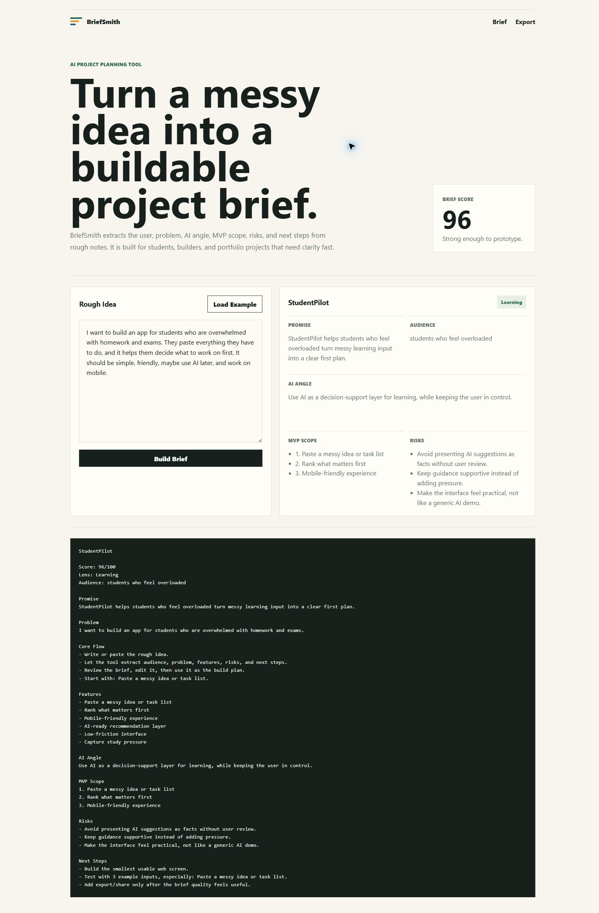

# BriefSmith

BriefSmith turns rough AI product ideas into clear project briefs. It is built for students and builders who want to move from "I have an idea" to "I know what to build first."



## What It Does

- Detects the likely project lens: learning, productivity, wellbeing, career, or creative.
- Extracts audience, promise, problem, AI angle, MVP scope, risks, and next steps.
- Runs fully locally in the browser or terminal.
- Helps shape AI-focused portfolio projects without needing an API key.

## Why It Helps

AI projects often start too vague. BriefSmith makes the first version smaller, clearer, and easier to explain in a README, demo, or LinkedIn post.

## Run The Web App

```bash
npm start
```

Open:

```text
http://localhost:5180
```

## Run The CLI

```bash
node bin/briefsmith.js --demo
```

From a file:

```bash
node bin/briefsmith.js --file examples/idea.txt
```

From stdin:

```bash
echo "AI app idea..." | node bin/briefsmith.js
```

## Project Structure

```text
briefsmith/
  index.html
  bin/briefsmith.js
  src/brief-engine.js
  src/app.js
  src/styles.css
  examples/idea.txt
```

## Author

Alfredo Oliva
